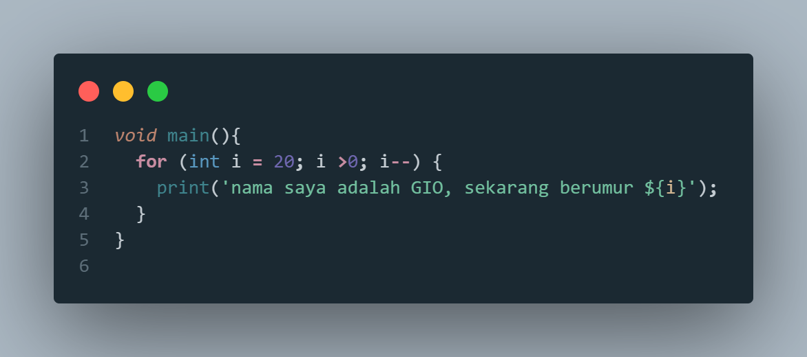
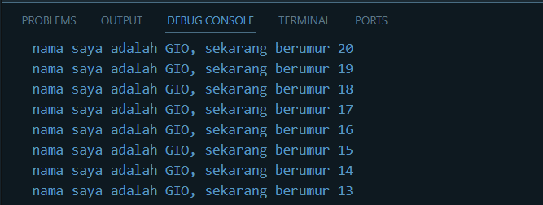
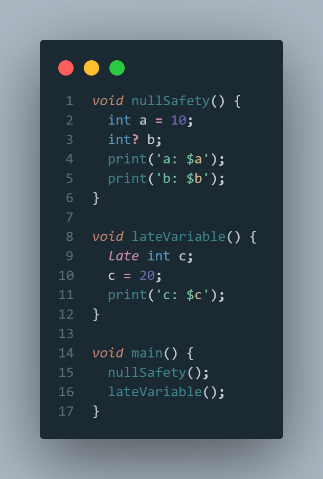
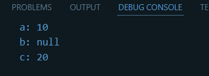

Soal 1

Kode Dart

Hasil Kode

Soal 2

Mengapa sangat penting untuk memahami bahasa pemrograman Dart sebelum kita menggunakan framework Flutter ? Jelaskan!

>Memahami bahasa pemrograman Dart sangat penting sebelum menggunakan framework Flutter karena Flutter dibangun dengan bahasa Dart. Pengetahuan yang baik tentang Dart akan memudahkan dalam memahami konsep dasar Flutter, seperti struktur kode, penggunaan variabel, fungsi, class, dan fitur-fitur khusus seperti Null Safety. Dengan menguasai Dart, pengembangan aplikasi menggunakan Flutter menjadi lebih efisien, mudah dalam debugging, serta memaksimalkan fitur-fitur yang disediakan oleh framework tersebut. 

Soal 3
    
    Rangkumlah materi dari codelab ini menjadi poin-poin penting yang dapat Anda gunakan untuk membantu proses pengembangan aplikasi mobile menggunakan framework Flutter.

>Dari yang saya pelajari, berikut adalah poin penting yang dapat membantu proses pengembangan aplikasi mobile menggunakan framework Flutter:
1. mempelajari garbage collection untuk memperingan sistem aplikasi
2. orientasi objek yang sedikit berbeda dari java yang mana pada dart lebih fleksibel

Soal 4

    Buatlah penjelasan dan contoh eksekusi kode tentang perbedaan Null Safety dan Late variabel !

>Null Safety adalah fitur dart yang mana variable tidak boleh berinal null kecuali diizinkan dengan anda '?', dengan null safety variable non nullable harus diinisialisasi sebelum digunakan. sedangkan late variable digunakan untuk menunda inisialisasi variable non nullable sampai akhirnya digunakan. berikut adalah contoh kode nya

Kode Program

Hasil Kode

